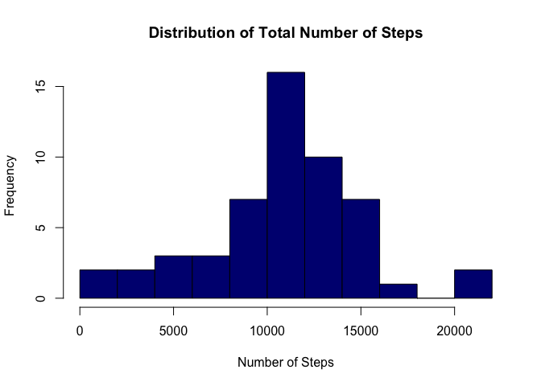
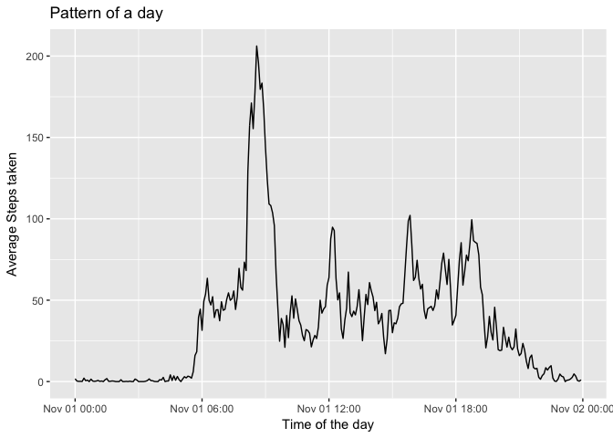
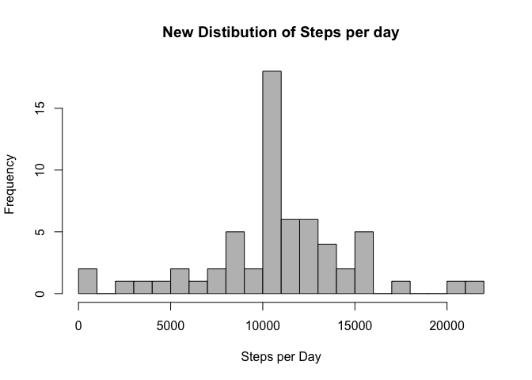
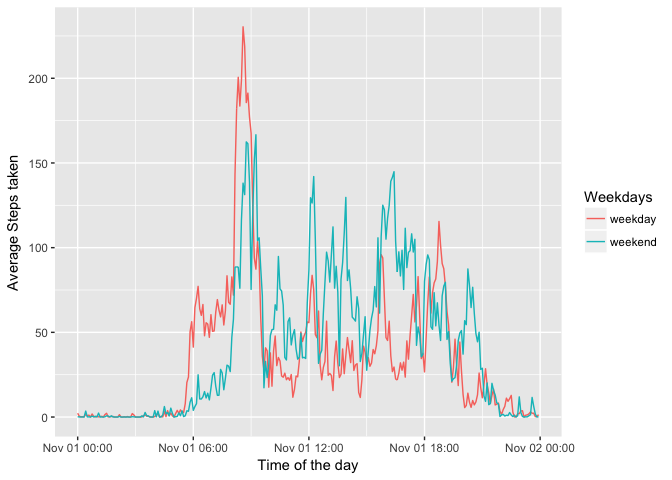

# Reproducible Research: Peer Assessment 1


```r
knitr::opts_chunk$set(echo = TRUE)
```


##Load libraries

```r
library(ggplot2)
library(dplyr)
```

```
## 
## Attaching package: 'dplyr'
```

```
## The following objects are masked from 'package:stats':
## 
##     filter, lag
```

```
## The following objects are masked from 'package:base':
## 
##     intersect, setdiff, setequal, union
```

## Loading and preprocessing the data

```r
my_data<-read.csv("~/MyProjects/representative projects/week2/activity.csv", header=TRUE)
head(my_data)
```

```
##   steps       date interval
## 1    NA 2012-10-01        0
## 2    NA 2012-10-01        5
## 3    NA 2012-10-01       10
## 4    NA 2012-10-01       15
## 5    NA 2012-10-01       20
## 6    NA 2012-10-01       25
```

```r
tail(my_data)
```

```
##       steps       date interval
## 17563    NA 2012-11-30     2330
## 17564    NA 2012-11-30     2335
## 17565    NA 2012-11-30     2340
## 17566    NA 2012-11-30     2345
## 17567    NA 2012-11-30     2350
## 17568    NA 2012-11-30     2355
```

```r
str(my_data)
```

```
## 'data.frame':	17568 obs. of  3 variables:
##  $ steps   : int  NA NA NA NA NA NA NA NA NA NA ...
##  $ date    : Factor w/ 61 levels "2012-10-01","2012-10-02",..: 1 1 1 1 1 1 1 1 1 1 ...
##  $ interval: int  0 5 10 15 20 25 30 35 40 45 ...
```


## What is mean total number of steps taken per day?
##2.histogram of number steps taken each day
#Summarise data, removing missing numbers, formating dates and summing up total number of steps taken

```r
my_data$newformat<-as.character(my_data$date)
my_data$newformat<-as.Date(my_data$newformat)

k<-my_data%>%
        select(steps, newformat)%>%
        filter(!is.na(steps))%>%
        group_by(newformat)%>%
        summarise(SumSteps=sum(steps))
```

#Putting the numbers on histogram


```r
hist(k$SumSteps, main = "Distribution of Total Number of Steps", 
     xlab = "Number of Steps", 
     ylab = "Frequency", 
     breaks=10,   col = "navy")
```

<!-- -->

#3.Mean and median number of steps taken each day

```r
summary(k$SumSteps)
```

```
##    Min. 1st Qu.  Median    Mean 3rd Qu.    Max. 
##      41    8841   10760   10770   13290   21190
```


## What is the average daily activity pattern?

#4. 5 minutes time series plot of the average number of steps taken
# Takinf the means of each 5 minutes interval, exluding missing data

```r
j<-my_data%>%
        select(steps, interval)%>%
        filter(!is.na(steps))%>%
        group_by(interval)%>%
        summarise(AvgSteps=mean(steps))
j
```

```
## # A tibble: 288 x 2
##    interval  AvgSteps
##       <int>     <dbl>
##  1        0 1.7169811
##  2        5 0.3396226
##  3       10 0.1320755
##  4       15 0.1509434
##  5       20 0.0754717
##  6       25 2.0943396
##  7       30 0.5283019
##  8       35 0.8679245
##  9       40 0.0000000
## 10       45 1.4716981
## # ... with 278 more rows
```

#Plotting the data, formating the intervals into the real time of he day

```r
ggplot(j, aes(y=AvgSteps, x=strptime(sprintf("%04d", j$interval), format="%H%M")))+geom_line()+labs(x= "Time of the day") + labs(y="Average Steps taken")+labs(title="Pattern of a day")
```

<!-- -->

Here we see the patterns of the day

#5.The 5-minute interval that, on average, contains the maximum number of steps

```r
   j%>%
        select(AvgSteps, interval)%>%
         filter(AvgSteps==max(AvgSteps))
```

```
## # A tibble: 1 x 2
##   AvgSteps interval
##      <dbl>    <int>
## 1 206.1698      835
```

Here we see that the average maximum number of steps was taken in the 835th inteval


## Imputing missing values

#6.Code to describe and show a strategy for imputing missing data

```r
n.missing<-sum(is.na(my_data))#number of missing values in the dataset
```


Imputting missing data by mean number of steps taken a day.

```r
StepsImputed<- inner_join(my_data, j,  by="interval") %>% 
                    mutate(steps=ifelse(is.na(steps), AvgSteps, steps)) %>%
                    select(date, interval, steps)
head(StepsImputed)
```

```
##         date interval     steps
## 1 2012-10-01        0 1.7169811
## 2 2012-10-01        5 0.3396226
## 3 2012-10-01       10 0.1320755
## 4 2012-10-01       15 0.1509434
## 5 2012-10-01       20 0.0754717
## 6 2012-10-01       25 2.0943396
```


## Are there differences in activity patterns between weekdays and weekends?

Summary of the new data, wee see there is no NAs


```r
summary(StepsImputed)
```

```
##          date          interval          steps       
##  2012-10-01:  288   Min.   :   0.0   Min.   :  0.00  
##  2012-10-02:  288   1st Qu.: 588.8   1st Qu.:  0.00  
##  2012-10-03:  288   Median :1177.5   Median :  0.00  
##  2012-10-04:  288   Mean   :1177.5   Mean   : 37.38  
##  2012-10-05:  288   3rd Qu.:1766.2   3rd Qu.: 27.00  
##  2012-10-06:  288   Max.   :2355.0   Max.   :806.00  
##  (Other)   :15840
```


it's time to see new averages of steps done per day

```r
z<-StepsImputed%>%
        select(steps, date)%>%
        group_by(date)%>%
        summarise(SumSteps=sum(steps))
z 
```

```
## # A tibble: 61 x 2
##          date SumSteps
##        <fctr>    <dbl>
##  1 2012-10-01 10766.19
##  2 2012-10-02   126.00
##  3 2012-10-03 11352.00
##  4 2012-10-04 12116.00
##  5 2012-10-05 13294.00
##  6 2012-10-06 15420.00
##  7 2012-10-07 11015.00
##  8 2012-10-08 10766.19
##  9 2012-10-09 12811.00
## 10 2012-10-10  9900.00
## # ... with 51 more rows
```

```r
summary(z$SumSteps)
```

```
##    Min. 1st Qu.  Median    Mean 3rd Qu.    Max. 
##      41    9819   10770   10770   12810   21190
```

Wee see that the median increased by 10 steps/day.


 #It's time to plot


```r
hist(z$SumSteps,  main = "New Distibution of Steps per day", 
     xlab = "Steps per Day", 
     ylab = "Frequency ", 
     breaks=20,   col = "grey")
```

<!-- -->

#8.Panel plot comparing the average number of steps taken per 5-minute interval across weekdays and weekends


Determine the weekdays and weekends, based on date column, with imputed data.

```r
StepsImputed$date<-as.Date(StepsImputed$date)
StepsImputed <- StepsImputed %>%
    mutate(Weekdays = ifelse(weekdays(date) %in% c("Saturday","Sunday"),
                                     "weekend","weekday"))
           
head(StepsImputed)
```

```
##         date interval     steps Weekdays
## 1 2012-10-01        0 1.7169811  weekday
## 2 2012-10-01        5 0.3396226  weekday
## 3 2012-10-01       10 0.1320755  weekday
## 4 2012-10-01       15 0.1509434  weekday
## 5 2012-10-01       20 0.0754717  weekday
## 6 2012-10-01       25 2.0943396  weekday
```

Number of steps taken by the day of the week

```r
a<-StepsImputed%>%
        select(steps, interval, Weekdays)%>%
        group_by(Weekdays, interval )%>%
        summarise(AvgSteps=mean(steps))
a
```

```
## # A tibble: 576 x 3
## # Groups:   Weekdays [?]
##    Weekdays interval   AvgSteps
##       <chr>    <int>      <dbl>
##  1  weekday        0 2.25115304
##  2  weekday        5 0.44528302
##  3  weekday       10 0.17316562
##  4  weekday       15 0.19790356
##  5  weekday       20 0.09895178
##  6  weekday       25 1.59035639
##  7  weekday       30 0.69266247
##  8  weekday       35 1.13794549
##  9  weekday       40 0.00000000
## 10  weekday       45 1.79622642
## # ... with 566 more rows
```


```r
ggplot(a, aes(y=AvgSteps, x=strptime(sprintf("%04d", a$interval), format="%H%M")))+geom_line(aes(col=Weekdays))+labs(x= "Time of the day") + labs(y="Average Steps taken")
```

<!-- -->


